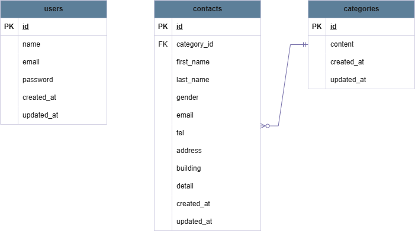

# test-contact-form

coachtech お問い合わせフォーム実装（確認テスト）

## 環境構築

### Dockerビルド

- git clone git@github.com:misone-ne/test-contact-form.git
- cd test-contact-form/
- docker-compose up -d --build

### Laravel環境構築

- docker-compose exec php bash
- composer install
- cp .env.example .env

※DB接続のため、.envを以下に修正してください

DB_CONNECTION=mysql
DB_HOST=mysql
DB_PORT=3306
DB_DATABASE=laravel_db
DB_USERNAME=laravel_user
DB_PASSWORD=laravel_pass

- php artisan key:generate
- php artisan migrate:fresh --seed

## 使用技術（実行環境）

- PHP 8.1.34
- Laravel 8.83.8
- mysql 8.0.26
- nginx 1.21.1
- Docker 29.1.3

## ER図

## URL

- お問い合わせフォーム入力ページ：http://localhost/
- ユーザ登録：http://localhost/register
- ログイン：http://localhost/login
- 管理画面：http://localhost/admin （※要ログイン）
- phpMyAdmin：http://localhost:8080
